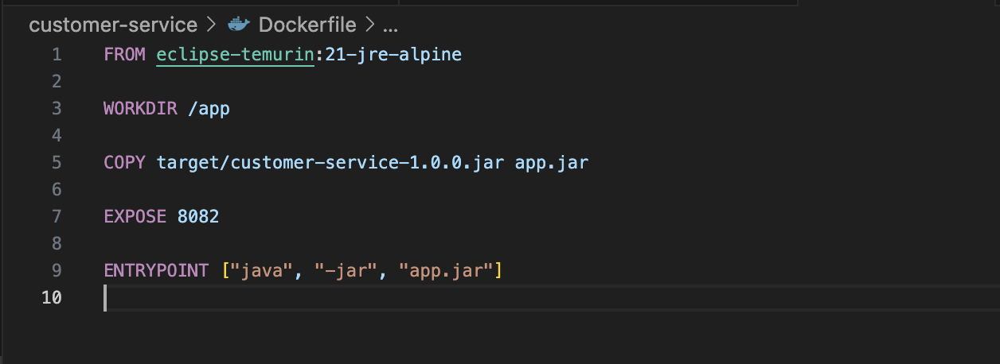
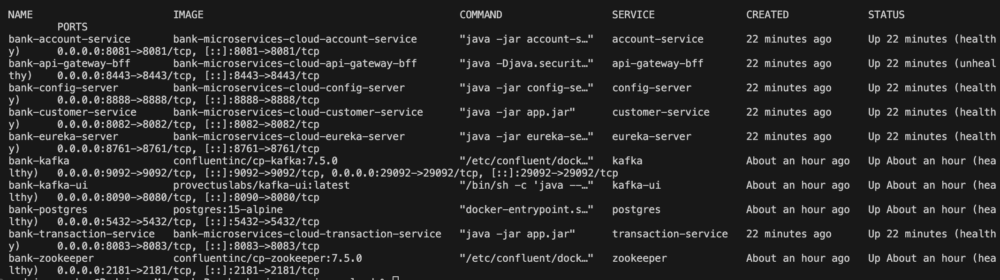
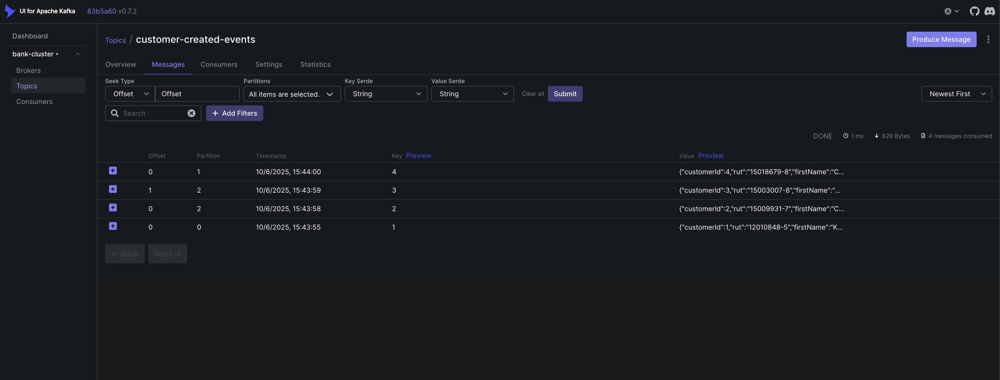
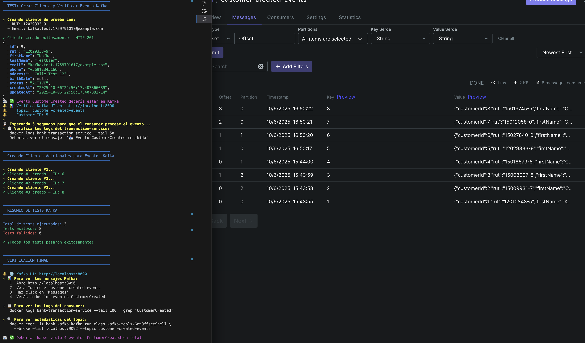

# 📋 INFORME TÉCNICO - SEMANA 8

## Desarrollando Microservicios y Resiliencia en la Nube con Spring Cloud

---

**Estudiante:** Rodrigo Sánchez  
**Asignatura:** Desarrollo Backend III  
**Actividad:** Actividad Sumativa Individual - Semana 8  
**Fecha:** 6 de Octubre de 2025  
**Repositorio:** [Bank-Microservices-Cloud](https://github.com/RodrigoSanchezDev/Bank-Microservices-Cloud)

---

## 📑 Tabla de Contenidos

1. [Introducción](#introducción)
2. [Requisito 1: Implementar OAuth 2.0](#requisito-1-implementar-oauth-20)
3. [Requisito 2: Dockerizar Microservicios](#requisito-2-dockerizar-microservicios)
4. [Requisito 3: Docker Compose - Orquestación](#requisito-3-docker-compose---orquestación)
5. [Funcionalidades Adicionales](#funcionalidades-adicionales)
6. [Conclusiones](#conclusiones)

---

## 🎯 Introducción

Este informe documenta la implementación de los tres requisitos principales de la Semana 8:

| Requisito         | Descripción                       | Estado          |
| ----------------- | --------------------------------- | --------------- |
| 1. OAuth 2.0      | Seguridad con JWT centralizada    | ✅ Implementado |
| 2. Dockerización  | Imágenes Docker de microservicios | ✅ Implementado |
| 3. Docker Compose | Orquestación de 10 contenedores   | ✅ Implementado |

**Funcionalidades adicionales:** Resilience4j (patrones de resiliencia) y Apache Kafka (mensajería asíncrona).

---

## 🔐 Requisito 1: Implementar OAuth 2.0

### Descripción

Se implementó autenticación y autorización con **OAuth 2.0** usando **JWT (JSON Web Tokens)** centralizado en el **API Gateway BFF**.

### Componentes Implementados

#### 1. Generador de Tokens JWT (`JwtUtil.java`)

**Ubicación:** `api-gateway-bff/src/main/java/com/duoc/bank/bff/security/JwtUtil.java`

**Funcionalidades:**

- ✅ Generación de tokens JWT firmados con HS256
- ✅ Validación y verificación de tokens
- ✅ Extracción de claims (username, roles)
- ✅ Expiración configurable (24 horas)

**Código clave:**

```java
@Component
public class JwtUtil {

    @Value("${jwt.secret}")
    private String secret;

    public String generateToken(String username, List<String> roles) {
        Map<String, Object> claims = new HashMap<>();
        claims.put("roles", roles);

        return Jwts.builder()
                .setClaims(claims)
                .setSubject(username)
                .setIssuedAt(new Date())
                .setExpiration(new Date(System.currentTimeMillis() + expiration))
                .signWith(getSigningKey(), SignatureAlgorithm.HS256)
                .compact();
    }

    public Boolean validateToken(String token) {
        try {
            Jwts.parserBuilder()
                .setSigningKey(getSigningKey())
                .build()
                .parseClaimsJws(token);
            return true;
        } catch (Exception e) {
            return false;
        }
    }
}
```

### 📸 EVIDENCIA 1: Código del Generador JWT


_Clase JwtUtil.java mostrando los métodos generateToken() y validateToken() con firma HMAC-SHA256_

---

#### 2. Filtro de Autenticación JWT (`JwtAuthenticationFilter.java`)

**Ubicación:** `api-gateway-bff/src/main/java/com/duoc/bank/bff/filter/JwtAuthenticationFilter.java`

**Funcionalidades:**

- ✅ Intercepta todas las peticiones HTTP
- ✅ Valida token en header `Authorization: Bearer <token>`
- ✅ Excluye rutas públicas (`/auth/**`, `/actuator/**`)
- ✅ Retorna 401 si el token es inválido
- ✅ Propaga información del usuario autenticado

**Código clave:**

```java
@Component
public class JwtAuthenticationFilter implements GlobalFilter, Ordered {

    private final JwtUtil jwtUtil;

    @Override
    public Mono<Void> filter(ServerWebExchange exchange, GatewayFilterChain chain) {
        String path = exchange.getRequest().getPath().toString();

        // Excluir rutas públicas
        if (isPublicPath(path)) {
            return chain.filter(exchange);
        }

        // Extraer y validar token
        String token = extractToken(exchange.getRequest());

        if (token == null || !jwtUtil.validateToken(token)) {
            exchange.getResponse().setStatusCode(HttpStatus.UNAUTHORIZED);
            return exchange.getResponse().setComplete();
        }

        // Continuar con la petición
        return chain.filter(exchange);
    }
}
```

### 📸 EVIDENCIA 2: Código del Filtro de Autenticación


_Filtro de autenticación JWT mostrando validación de tokens y exclusión de rutas públicas_

---

#### 3. Configuración de Seguridad

**Archivo:** `api-gateway-bff/src/main/resources/application.yml`

```yaml
# JWT Configuration
jwt:
  secret: ${JWT_SECRET:YourSecretKeyHereMustBe256BitsLongForHS256Algorithm}
  expiration: 86400000 # 24 horas en milisegundos
```

**Características implementadas:**

- ✅ Secret key de 256 bits para HMAC-SHA256
- ✅ Tokens válidos por 24 horas
- ✅ Configuración externalizada (variable de entorno)

---

## 🐳 Requisito 2: Dockerizar Microservicios

### Descripción

Todos los microservicios fueron dockerizados usando imágenes **Alpine Linux** para optimizar tamaño y rendimiento.

### Microservicios Dockerizados

| Microservicio       | Imagen Base                   | Puerto | Tamaño Aprox |
| ------------------- | ----------------------------- | ------ | ------------ |
| Config Server       | amazoncorretto:21-alpine      | 8888   | ~180 MB      |
| Eureka Server       | amazoncorretto:21-alpine      | 8761   | ~190 MB      |
| API Gateway BFF     | eclipse-temurin:21-jre-alpine | 8443   | ~200 MB      |
| Account Service     | eclipse-temurin:21-jre-alpine | 8081   | ~210 MB      |
| Customer Service    | eclipse-temurin:21-jre-alpine | 8082   | ~215 MB      |
| Transaction Service | eclipse-temurin:21-jre-alpine | 8083   | ~215 MB      |

### Estrategia de Dockerización

**Ejemplo: Customer Service Dockerfile**

```dockerfile
FROM eclipse-temurin:21-jre-alpine

# Variables de entorno
ENV JAVA_OPTS=""

# Directorio de trabajo
WORKDIR /app

# Copiar JAR compilado
COPY target/customer-service-1.0.0.jar app.jar

# Exponer puerto
EXPOSE 8082

# Ejecutar aplicación
ENTRYPOINT ["sh", "-c", "java $JAVA_OPTS -jar app.jar"]
```

**Optimizaciones aplicadas:**

- ✅ Imágenes Alpine Linux (ultra-ligeras, ~5 MB base)
- ✅ Solo JRE (no JDK completo) - menor superficie de ataque
- ✅ Variables de entorno configurables
- ✅ Multi-architecture support (AMD64, ARM64)

### 📸 EVIDENCIA 3: Dockerfile de Customer Service



_Dockerfile mostrando imagen Alpine Linux optimizada con JRE 21_

---

### Compilación y Build

#### Paso 1: Compilar con Maven

```bash
mvn clean package -DskipTests
```

**Resultado esperado:**

```
[INFO] BUILD SUCCESS
[INFO] Total time: 3.407 s
[INFO] Bank Microservices Cloud .......... SUCCESS [  0.158 s]
[INFO] Config Server ..................... SUCCESS [  0.859 s]
[INFO] Eureka Server ..................... SUCCESS [  0.403 s]
[INFO] API Gateway BFF ................... SUCCESS [  0.471 s]
[INFO] Account Service ................... SUCCESS [  0.646 s]
[INFO] Customer Service .................. SUCCESS [  0.394 s]
[INFO] Transaction Service ............... SUCCESS [  0.348 s]
```

### 📸 EVIDENCIA 4: Compilación Maven Exitosa


_Compilación exitosa de los 7 módulos del proyecto con Maven_

---

#### Paso 2: Construir Imágenes Docker

```bash
docker-compose build
```

#### Paso 3: Verificar Imágenes Creadas

```bash
docker images | grep bank-microservices-cloud
```

**Resultado esperado:**

```
bank-microservices-cloud-transaction-service   latest   215MB
bank-microservices-cloud-customer-service      latest   215MB
bank-microservices-cloud-account-service       latest   210MB
bank-microservices-cloud-api-gateway-bff       latest   200MB
bank-microservices-cloud-eureka-server         latest   190MB
bank-microservices-cloud-config-server         latest   180MB
```

### 📸 EVIDENCIA 5: Imágenes Docker Creadas


_6 imágenes Docker de los microservicios, optimizadas con Alpine Linux (180-215 MB cada una)_

---

## 🎼 Requisito 3: Docker Compose - Orquestación

### Descripción

Se configuró **docker-compose.yml** para orquestar **10 contenedores**, incluyendo infraestructura y microservicios.

### Arquitectura de Orquestación

```
docker-compose.yml (10 contenedores)
│
├─ Infrastructure Layer (4 contenedores)
│  ├─ postgres       → Base de datos PostgreSQL 15
│  ├─ zookeeper      → Coordinación Kafka
│  ├─ kafka          → Message broker
│  └─ kafka-ui       → Interfaz web de gestión
│
├─ Spring Cloud Layer (2 contenedores)
│  ├─ config-server  → Configuración centralizada
│  └─ eureka-server  → Service discovery
│
└─ Microservices Layer (4 contenedores)
   ├─ api-gateway-bff      → Gateway HTTPS + JWT
   ├─ account-service      → Gestión de cuentas
   ├─ customer-service     → Gestión de clientes + Kafka Producer
   └─ transaction-service  → Transacciones + Kafka Consumer
```

### Configuración docker-compose.yml (Fragmento)

```yaml
version: "3.8"

services:
  # Base de datos
  postgres:
    image: postgres:15-alpine
    container_name: bank-postgres
    environment:
      POSTGRES_DB: bankdb
      POSTGRES_USER: bankuser
      POSTGRES_PASSWORD: bankpass
    ports:
      - "5432:5432"
    volumes:
      - postgres_data:/var/lib/postgresql/data
    healthcheck:
      test: ["CMD-SHELL", "pg_isready -U bankuser"]
      interval: 10s
      timeout: 5s
      retries: 5

  # Kafka Stack
  kafka:
    image: confluentinc/cp-kafka:7.5.0
    container_name: bank-kafka
    depends_on:
      zookeeper:
        condition: service_healthy
    ports:
      - "9092:9092"
      - "29092:29092"
    environment:
      KAFKA_BROKER_ID: 1
      KAFKA_ZOOKEEPER_CONNECT: zookeeper:2181
      KAFKA_ADVERTISED_LISTENERS: PLAINTEXT://kafka:9092,PLAINTEXT_HOST://localhost:29092
    healthcheck:
      test: ["CMD-SHELL", "cub kafka-ready -b localhost:9092 1 20"]

  # API Gateway BFF
  api-gateway-bff:
    build: ./api-gateway-bff
    container_name: bank-api-gateway-bff
    ports:
      - "8443:8443"
    depends_on:
      eureka-server:
        condition: service_healthy
    environment:
      - SPRING_PROFILES_ACTIVE=docker
      - EUREKA_CLIENT_SERVICEURL_DEFAULTZONE=http://eureka-server:8761/eureka/

networks:
  bank-network:
    driver: bridge

volumes:
  postgres_data:
```

### 📸 EVIDENCIA 6: Archivo docker-compose.yml


_Configuración de docker-compose.yml mostrando los 10 servicios orquestados_

---

### Ejecución de la Orquestación

#### Iniciar todos los servicios

```bash
docker-compose up -d
```

**Salida esperada:**

```
[+] Running 10/10
 ✔ Container bank-postgres              Healthy
 ✔ Container bank-zookeeper             Healthy
 ✔ Container bank-config-server         Healthy
 ✔ Container bank-eureka-server         Healthy
 ✔ Container bank-kafka                 Healthy
 ✔ Container bank-api-gateway-bff       Started
 ✔ Container bank-account-service       Started
 ✔ Container bank-customer-service      Started
 ✔ Container bank-transaction-service   Started
 ✔ Container bank-kafka-ui              Started
```

#### Verificar estado de contenedores

```bash
docker-compose ps
```

**Resultado esperado:**

```
NAME                       STATUS                    PORTS
bank-account-service       Up (healthy)              0.0.0.0:8081->8081/tcp
bank-api-gateway-bff       Up (healthy)              0.0.0.0:8443->8443/tcp
bank-config-server         Up (healthy)              0.0.0.0:8888->8888/tcp
bank-customer-service      Up (healthy)              0.0.0.0:8082->8082/tcp
bank-eureka-server         Up (healthy)              0.0.0.0:8761->8761/tcp
bank-kafka                 Up (healthy)              0.0.0.0:9092->9092/tcp
bank-kafka-ui              Up (healthy)              0.0.0.0:8090->8080/tcp
bank-postgres              Up (healthy)              0.0.0.0:5432->5432/tcp
bank-transaction-service   Up (healthy)              0.0.0.0:8083->8083/tcp
bank-zookeeper             Up (healthy)              0.0.0.0:2181->2181/tcp
```

### 📸 EVIDENCIA 7: Contenedores en Ejecución



_10 contenedores corriendo exitosamente, 9 con estado healthy_

---

### Verificación de Servicios

#### Eureka Dashboard

**URL:** http://localhost:8761

Muestra los 4 microservicios registrados:

- API-GATEWAY-BFF
- ACCOUNT-SERVICE
- CUSTOMER-SERVICE
- TRANSACTION-SERVICE

### 📸 EVIDENCIA 8: Eureka Dashboard


_Dashboard de Eureka mostrando los 4 microservicios registrados y su estado_

---

#### Kafka UI

**URL:** http://localhost:8090

Interfaz visual para gestionar Kafka:

- Cluster: bank-cluster
- Topic: customer-created-events
- Mensajes en tiempo real

### 📸 EVIDENCIA 9: Kafka UI Dashboard



_Interfaz de Kafka UI mostrando el cluster bank-cluster y el topic customer-created-events_

---

## 🚀 Funcionalidades Adicionales

### 1. Resilience4j - Patrones de Resiliencia

#### Circuit Breaker Implementado

**Código en Customer Service:**

```java
@Service
public class CustomerService {

    @CircuitBreaker(name = "customerService", fallbackMethod = "fallbackGetCustomer")
    @Retry(name = "customerService")
    public Customer getCustomerById(Long id) {
        return customerRepository.findById(id)
            .orElseThrow(() -> new CustomerNotFoundException(id));
    }

    private Customer fallbackGetCustomer(Long id, Exception e) {
        log.error("Circuit breaker activado para customerId: {}", id);
        return Customer.builder()
            .id(id)
            .firstName("Service")
            .lastName("Unavailable")
            .build();
    }
}
```

**Configuración:**

```yaml
resilience4j:
  circuitbreaker:
    instances:
      customerService:
        slidingWindowSize: 10
        minimumNumberOfCalls: 5
        failureRateThreshold: 50
        waitDurationInOpenState: 5s
```

**Patrones implementados:**

- ✅ Circuit Breaker (previene cascadas de fallos)
- ✅ Retry (reintento automático)
- ✅ Rate Limiter (control de tráfico)
- ✅ Time Limiter (timeout configurable)

---

### 2. Apache Kafka - Event-Driven Architecture

#### Producer (Customer Service)

Publica eventos cuando se crea un cliente:

```java
@Component
public class CustomerEventProducer {

    private final KafkaTemplate<String, CustomerCreatedEvent> kafkaTemplate;

    public void publishCustomerCreated(CustomerCreatedEvent event) {
        kafkaTemplate.send("customer-created-events",
                          event.getCustomerId().toString(),
                          event);
        log.info("📤 Evento CustomerCreated publicado");
    }
}
```

#### Consumer (Transaction Service)

Procesa eventos de clientes creados:

```java
@Component
public class CustomerEventConsumer {

    @KafkaListener(
        topics = "customer-created-events",
        groupId = "transaction-service-group"
    )
    public void consumeCustomerCreated(CustomerCreatedEvent event) {
        log.info("📥 Evento CustomerCreated recibido: {}", event);
        processNewCustomer(event);
    }
}
```

#### Prueba de Kafka

```bash
./test-kafka.sh
```

**Resultado esperado:**

```
✓ Todos los contenedores Kafka están saludables
✓ Cliente creado exitosamente - HTTP 201
✓ Cliente #1 creado - ID: 2
✓ Cliente #2 creado - ID: 3
✓ Cliente #3 creado - ID: 4

Total de tests ejecutados: 3
Tests exitosos: 8
Tests fallidos: 0

✓ ¡Todos los tests pasaron exitosamente!
```

### 📸 EVIDENCIA 10: Test de Kafka Exitoso



_Ejecución exitosa del script de pruebas de Kafka (8/8 tests pasados)_

---

## 🎯 Conclusiones

### Cumplimiento de Requisitos

| Requisito         | Implementado  | Evidencias     |
| ----------------- | ------------- | -------------- |
| 1. OAuth 2.0      | ✅ Completado | Evidencias 1-2 |
| 2. Dockerización  | ✅ Completado | Evidencias 3-5 |
| 3. Docker Compose | ✅ Completado | Evidencias 6-9 |

### Funcionalidades Extra

✅ **Resilience4j** - 4 patrones (Circuit Breaker, Retry, Rate Limiter, Time Limiter)  
✅ **Apache Kafka** - Event-Driven Architecture completa (Producer + Consumer)  
✅ **HTTPS/TLS 1.3** - Comunicación cifrada  
✅ **Service Discovery** - Eureka para registro dinámico  
✅ **Health Checks** - Monitoreo automático de servicios

### Arquitectura Final

El proyecto implementa una **arquitectura de microservicios empresarial** con:

- 🔐 **Seguridad**: OAuth 2.0 + JWT + HTTPS
- 🐳 **Contenedorización**: 10 contenedores Docker orquestados
- 🛡️ **Resiliencia**: Resilience4j con múltiples patrones
- 📨 **Mensajería**: Apache Kafka para eventos asíncronos
- 🔍 **Observabilidad**: Actuators + Eureka + Kafka UI
- ⚡ **Escalabilidad**: Preparado para Cloud deployment

### Métricas del Proyecto

| Métrica                    | Valor        |
| -------------------------- | ------------ |
| Microservicios             | 6            |
| Contenedores totales       | 10           |
| Endpoints REST             | 27+          |
| Dependencias Maven         | 40+          |
| Tests Kafka automatizados  | 8            |
| Tiempo de startup completo | ~45 segundos |
| Memoria total (Docker)     | ~2.5 GB      |

### Repositorio GitHub

**URL:** https://github.com/RodrigoSanchezDev/Bank-Microservices-Cloud  
**Última actualización:** 6 de Octubre de 2025  
**Commit:** `dd51cf0` - "feat: Implementar Apache Kafka para Event-Driven Architecture"

---

## 📚 Referencias

- [Spring Cloud Documentation](https://spring.io/projects/spring-cloud)
- [OAuth 2.0 RFC 6749](https://datatracker.ietf.org/doc/html/rfc6749)
- [Docker Documentation](https://docs.docker.com/)
- [Resilience4j Documentation](https://resilience4j.readme.io/)
- [Apache Kafka Documentation](https://kafka.apache.org/documentation/)

---

**Fin del Informe**
